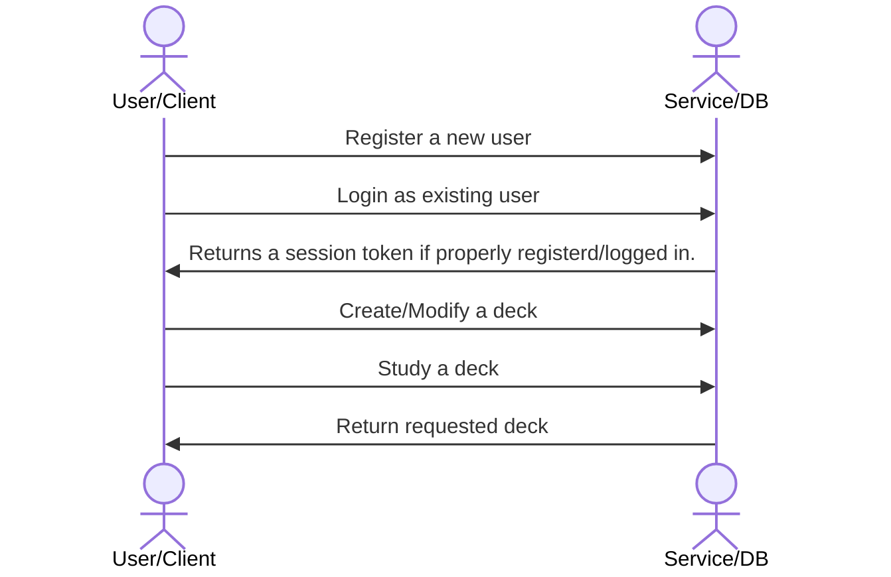

# Scripture Memorization Index - Owen Werts

[My Notes](notes.md)

A brief description of the application here. Options: New & Improved Scripture Memorization, etc.

> [!NOTE]
>  This is a template for your startup application. You must modify this `README.md` file for each phase of your development. You only need to fill in the section for each deliverable when that deliverable is submitted in Canvas. Without completing the section for a deliverable, the TA will not know what to look for when grading your submission. Feel free to add additional information to each deliverable description, but make sure you at least have the list of rubric items and a description of what you did for each item.

> [!NOTE]
>  If you are not familiar with Markdown then you should review the [documentation](https://docs.github.com/en/get-started/writing-on-github/getting-started-with-writing-and-formatting-on-github/basic-writing-and-formatting-syntax) before continuing.

## 🚀 Specification Deliverable

<ins>To Do:</ins>
- [x] Proper use of Markdown
- [x] A concise and compelling elevator pitch
- [x] Description of key features
- [x] Description of how you will use each technology
- [ ] One or more rough sketches of your application. Images must be embedded in this file using Markdown image references.

### Elevator pitch

Have you ever tried to make flashcards on your phone? Did you try typing your favorite passages of scripture in only to realize that it took you 30 minutes to finish 5 of them? Scripture Memorization Index is a flashcard application catered specifically to memorizing passages from the standard works of The Church of Jesus Christ of Latter-day Saints. The main goal is to minimize your time spent on creating flashcards by having all of the verses popluated by the application given a specific reference (i.e. 1 Nephi 3:7). Furthurmore, you can draw upon all the flashcard decks that other individuals have made!

> [!NOTE]
>  From here on out, the term "deck" is used to refer to a group of flashcards, or a deck, that is defined by a user. Decks can be studied, edited, & shared.

### Design
A rough sketch of the client UI.

A sequence diagram of the interactions between the user, through the client/webpage, and the database, through the service class endpoints.

### Key features

- Secure login with HTTPS
- Ability to create, copy, and edit decks of flashcards
- Ability to share flashcard deck edit & view access
- Notifications when a flashcard deck is shared or edited.
- Ability to create flashcard by entering a scripture reference (i.e. Ether 12:27 populates: "And if men come unto me, ...")
- Accuracy during a study session is tracked, stored, & reported
- Location in a study deck is maintained between logins or if connection is temporarily lost
- Difficult cards can be favorited for more frequent study

### Technologies

I am going to use the required technologies in the following ways:

- **HTML** - 4 HTML Pages
    1. Login Page
    2. Deck Management Page (including permissions)
    3. Deck Editing Page
    4. Studying a Deck Page
- **CSS** - Application styling for various screen/window sizes as well as mobile app styling for the PWA (Progressive Web App). Potential second mode for dark mode support.
- **React** - Basic front-end logic and management of login, deck editing, client-side logic (deck progress, accuracy percentage calculation, etc.)
- **Service** - Standard service endpoints for:
    - Register a user
    - Login a user
    - Logout
    - Creating a new deck
    - Deleting a deck
    - Creating a flashcard
    - Updating a flashcard
    - Deleting a flashcard
    - Updating deck view permissions
    - Updating deck edit permissions
- **DB/Login** - Securely store the following when directed by service endpoints:
    - User Credentials
    - User Session Token
    - User Decks (and child flashcards)
- **WebSocket** - Notify users when their decks have been edited or viewed. Notify users of permission changes to decks (being added to a deck, when an invitation to view/edit is accepted/rejected, etc.)

## 🚀 AWS deliverable

For this deliverable I did the following. I checked the box `[x]` and added a description for things I completed.

- [ ] **Server deployed and accessible with custom domain name** - [My server link](https://yourdomainnamehere.click).

## 🚀 HTML deliverable

For this deliverable I did the following. I checked the box `[x]` and added a description for things I completed.

- [ ] **HTML pages** - I did not complete this part of the deliverable.
- [ ] **Proper HTML element usage** - I did not complete this part of the deliverable.
- [ ] **Links** - I did not complete this part of the deliverable.
- [ ] **Text** - I did not complete this part of the deliverable.
- [ ] **3rd party API placeholder** - I did not complete this part of the deliverable.
- [ ] **Images** - I did not complete this part of the deliverable.
- [ ] **Login placeholder** - I did not complete this part of the deliverable.
- [ ] **DB data placeholder** - I did not complete this part of the deliverable.
- [ ] **WebSocket placeholder** - I did not complete this part of the deliverable.

## 🚀 CSS deliverable

For this deliverable I did the following. I checked the box `[x]` and added a description for things I completed.

- [ ] **Header, footer, and main content body** - I did not complete this part of the deliverable.
- [ ] **Navigation elements** - I did not complete this part of the deliverable.
- [ ] **Responsive to window resizing** - I did not complete this part of the deliverable.
- [ ] **Application elements** - I did not complete this part of the deliverable.
- [ ] **Application text content** - I did not complete this part of the deliverable.
- [ ] **Application images** - I did not complete this part of the deliverable.

## 🚀 React part 1: Routing deliverable

For this deliverable I did the following. I checked the box `[x]` and added a description for things I completed.

- [ ] **Bundled using Vite** - I did not complete this part of the deliverable.
- [ ] **Components** - I did not complete this part of the deliverable.
- [ ] **Router** - I did not complete this part of the deliverable.

## 🚀 React part 2: Reactivity deliverable

For this deliverable I did the following. I checked the box `[x]` and added a description for things I completed.

- [ ] **All functionality implemented or mocked out** - I did not complete this part of the deliverable.
- [ ] **Hooks** - I did not complete this part of the deliverable.

## 🚀 Service deliverable

For this deliverable I did the following. I checked the box `[x]` and added a description for things I completed.

- [ ] **Node.js/Express HTTP service** - I did not complete this part of the deliverable.
- [ ] **Static middleware for frontend** - I did not complete this part of the deliverable.
- [ ] **Calls to third party endpoints** - I did not complete this part of the deliverable.
- [ ] **Backend service endpoints** - I did not complete this part of the deliverable.
- [ ] **Frontend calls service endpoints** - I did not complete this part of the deliverable.
- [ ] **Supports registration, login, logout, and restricted endpoint** - I did not complete this part of the deliverable.

## 🚀 DB deliverable

For this deliverable I did the following. I checked the box `[x]` and added a description for things I completed.

- [ ] **Stores data in MongoDB** - I did not complete this part of the deliverable.
- [ ] **Stores credentials in MongoDB** - I did not complete this part of the deliverable.

## 🚀 WebSocket deliverable

For this deliverable I did the following. I checked the box `[x]` and added a description for things I completed.

- [ ] **Backend listens for WebSocket connection** - I did not complete this part of the deliverable.
- [ ] **Frontend makes WebSocket connection** - I did not complete this part of the deliverable.
- [ ] **Data sent over WebSocket connection** - I did not complete this part of the deliverable.
- [ ] **WebSocket data displayed** - I did not complete this part of the deliverable.
- [ ] **Application is fully functional** - I did not complete this part of the deliverable.
